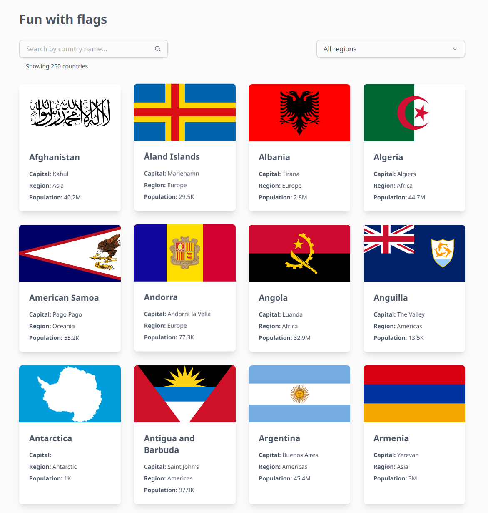

# Fun with Flags

Project to list the world countries and their info using https://restcountries.com/ API.

Available in: https://fun-with-flags-green.vercel.app/

## Getting Started

Clone the repo, enter in the fun-with-flags folder and install the dependencies:

```
git clone https://github.com/FredericoVieira/fun-with-flags.git
cd fun-with-flags
npm install
```

> I'm using **v22.12.0** and recommend the usage of NVM and the Node.js version >= v18.16.0 is required for run this project.

### Development

Run the development server:

```
npm run dev
```

Open http://localhost:3000 with your browser to see the initial page.

### Production

If you like to try the production build, run:

```
npm run build
```

And then:

```
npm run start
```

---

Made with ♥️ by Maíro Viana
